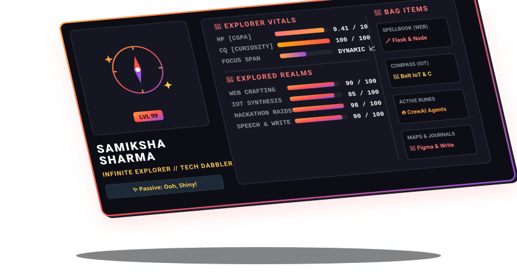

  

## 👋 Hey, I'm Samiksha!
I'm a Computer Engineering student at the **Army Institute of Technology, Pune** (sitting at a 9.41 CGPA!). 

To be honest, I'm just one of those people who gets easily excited by anything that looks cool or interesting. If a project or technology looks good and catches my eye, I'm instantly hooked and want to explore it. That's why I don't stick to just one thing—I love playing around with web systems, IoT hardware prototypes, and multi-agent AI networks.

*   🎓 **College Life**: Studying BE Computer Engineering at AIT Pune.
*   🧭 **Vibe**: Tech explorer. I love learning whatever looks cool instead of just mastering one stack.
*   💡 **Curiosity**: High! If it's interesting, I'll spend hours figuring it out.
*   🎤 **Beyond Code**: Former public speaking teacher for kids and AI data trainer. I enjoy managing events and working with people.
*   ✍️ **Creative Side**: When I'm offline, I'm usually writing stories/poems, reading books, or cycling.

 

## 🛠️ Tech I Use

### Coding Languages

  
  
  
  
  
  

### Frameworks & Tools

  
  
  
  
  
  
  
  

### IoT & Hardware

  
  
  

 

## 🚀 Projects I've Worked On

*   **🏥 JEEVAN - AI Hospital Management System**
    *   *AI, Flutter, Node.js, CrewAI, Blockchain*
    *   Built an AI-powered system for automated hospital emergency resource allocation.
    *   Created multi-agent AI workflows for automatic doctor, nurse, bed, and equipment assignment.
    *   Integrated secure blockchain records and IoT-based AQI monitoring.
*   **🛒 KindKart - Community Donation Platform**
    *   *HTML, CSS, JS, Flask, MySQL, Socket.IO*
    *   Developed a real-time platform with secure login and live donor-recipient chat.
    *   Implemented location-based donation workflow with a clean, responsive Neo-Brutalist UI.
*   **🏨 Smart Hostel Management System**
    *   *HTML, CSS, JS, Node.js, MySQL*
    *   Created a full-stack dashboard for room allocation, complaint tracking, and leave management.
    *   Designed a responsive Glassmorphism layout with role-based secure login.
*   **⚡ Smart Classroom Energy Monitoring System (IoT)**
    *   *Embedded C, MQTTBox, Grafana*
    *   Built an IoT automation system that turns off lights and fans based on classroom occupancy.
    *   Set up MQTT-based real-time tracking with a Grafana dashboard to prevent power wastage.

 

## 🏆 Achievements & Milestones
- 🎖️ Won the **Rajput Regiment Rolling Innovation Trophy** for the best innovation project at AIT, Pune.
- 🥇 Got **1st Prize in DecentraHack Hackathon** at PCCOE, Pune.
- 🏁 Finalist at **MumbaiHacks 2025**.
- 🔬 Awarded **Child Scientist** for 5 consecutive years (2018-2023) by NCSC at national level.
- 👑 **State Winner** in Bharat Ko Jano Quiz.

 

## 📊 My GitHub Stats

  

  

  

 

## 💬 Let's Connect!
*Feel free to reach out if you want to collaborate or just chat!*

  
  
  

 

  

